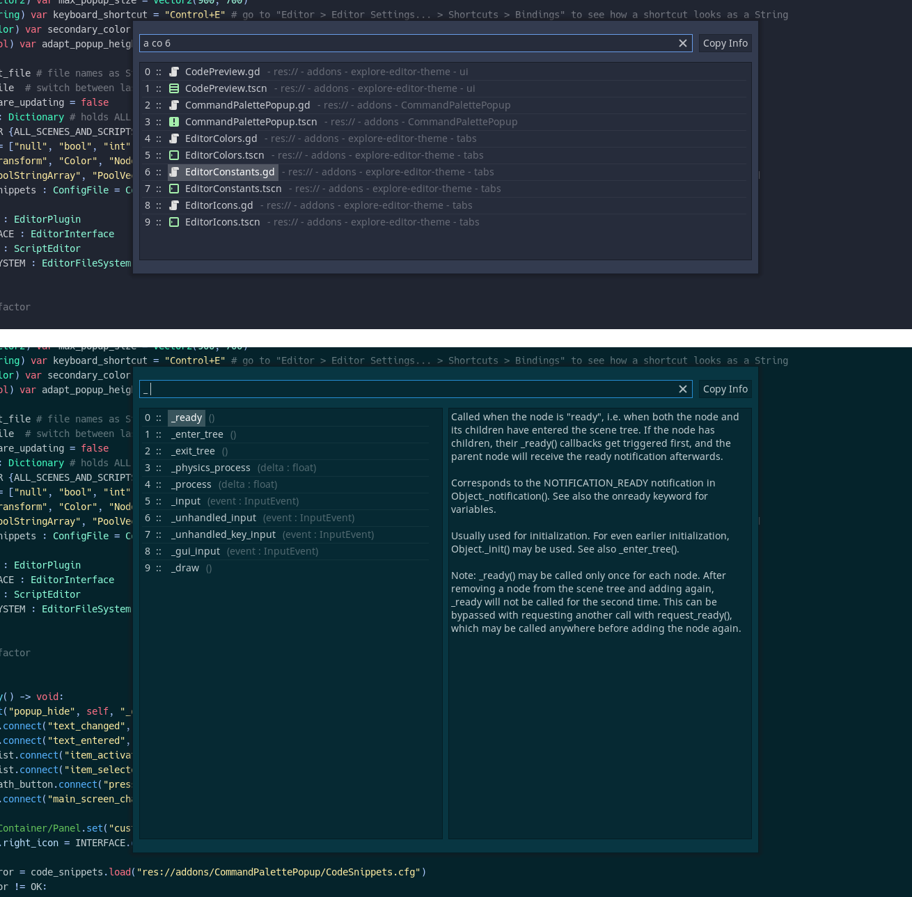

# Command Palette

This plugin for the Godot game engine 3.2.X adds a global keyboard shortcut to access a list of all (open) scripts and scenes which can be filtered by a search_string as well as code snippets.

**Features**:

- Pressing Ctrl+P (Command+P) opens a popup, which lists all open scenes and scripts.
- Pressing Ctrl+P (Command+P) while the popup is already open and no filter is applied will switch to the previously opened file (only works for files opened with this plugin).
- The file names are preceded by a line number and followed by their file path. Activating the file path will select the file in the filesystem dock.
- Ending the search_string with \" X\", where X is an integer, jumps to the X-th line in the list.
- Starting the search_string with \"a \" (a for all) will show ALL scripts and scenes.
- Starting the search-string with \"c \" (c for code) will show all OPEN scripts.
- Starting the search-string with \"s \" (s for scene) will show all OPEN scenes.
- Starting the search_string with \"ac \" or \"ca \" will show ALL SCRIPTS.
- Starting the search_string with \"as \" or \"sa \" will show ALL SCENES.
- Starting the search_string with \"sig \" will list all signals of the current scene root. Activating a signal will insert it at the cursor position with the cursor position moving to the signal target. The signal method will be copied to the clipboard.
- Starting the search_string with \": \" followed by an integer will jump to that line in the script editor.
- Starting the search_string with \"_ \" will show the available code snippets. Activating a snippet will insert it at the cursor position. Custom snippets can be created by editing CodeSnippets.cfg. Follow the key naming scheme. Take a look at _paste_code_snippet(), if you want to know how the snippet parts are merged. By default a few virtual methods are implemented.
- Ending the search_string with " e" when using the code snippets, will insert the snippet at the end of the file (instead of at the cursor position).

- Opening a script also opens the scene, which the script is attached to. It only works if the script is attached to the scene root. This gives you autocompletion on the Node(Paths) and their methods.

- A copy button is available to the right of the filter. This way you can quickly copy the file path or code snippet by tabbing from the filter box.

(The filter only applies to the actual file name, so you won't get flooded with search results)

**Installation**:

Either download it from the official Godot AssetLib (within Godot itself) or download the addons folder from GitHub (https://github.com/Leleat/CommandPalette) and move it to the root (res://) of your project. Enable the plugin in the project settings.

