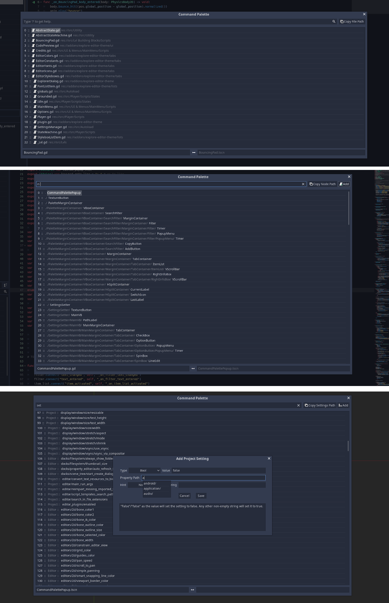

# A Godot Command Palette

**Features**:

- Pressing Ctrl+P (Command+P) opens a popup, which lists all open scripts.
- The file names are preceded by a line number and followed by their file path. Selecting the file path will select the file in the filesystem dock.
- Ending the search_string with \" X\", where X is an integer, jumps to the X-th line in the list.
- Starting the search_string with \"a \" (a for all) will show ALL scripts and scenes. **1.4.0: other files will be listed and can be opened as well**
- Starting the search_string with \"ac \" (c for code file) will show ALL SCRIPTS.
- Starting the search_string with \"as \" (s for scene) will show ALL SCENES.
- Starting the search-string with \"s \" will show all OPEN scenes.
- The file filter supports wildcards. The beginning and the end of the search_string will automatically use the *.
- Starting the search_string with \": \" followed by an integer will jump to that line in the script editor.
- Starting the search_string with \":m \" will list the methods of the current script and enables you to jump to a selected method.
- **1.4.0:** Project/Editor settings can be changed. New Project settings can be added as well.
- **1.4.0:** Starting the search_string with "n " will list all nodes in the current scene. Activating a node will select it in the scene tree dock. While the filter is active, you can add new scripts to any of the nodes.
- Pressing Ctrl+P (Command+P) while the popup is already open and no filter is applied will switch to the previously opened file (~~only works for files opened with this plugin~~ **1.4.0: it no longer matters how the file was opened**).

- Opening a script also opens the scene, which the script is attached to. It only works if the script is attached to the scene root. This gives you autocompletion on the Node(Paths) and their methods.

- A copy button is available to the right of the filter. This way you can quickly copy the file/node/settings path by tabbing from the filter box.

- Custom shortcuts and keywords can be set via the inspector.

(The filter applies to the actual file name for the open scens/scripts. For all files/scripts/scenes the filter matches the file path.)

**1.4.0:** The code snippets have been moved to their own plugin with a dedicated keyboard shortcut (and some small improvements). See https://github.com/Leleat/AGodotCodeSnippetPlugin

**Installation**:

Either download it from the official Godot AssetLib (within Godot itself) or download the addons folder from GitHub (https://github.com/Leleat/CommandPalette) and move it to the root (res://) of your project. Enable the plugin in the project settings.

