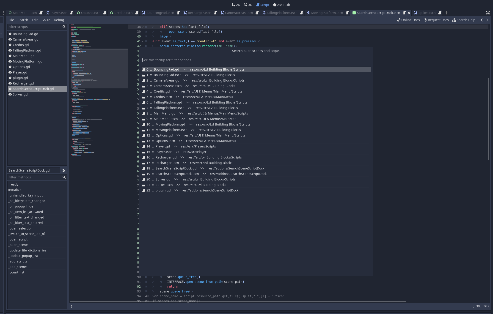

# SearchScriptScenePlugin

This plugin for the Godot game engine 3.2.X adds a global keyboard shortcut to access a list of all (open) scripts and scenes which can be filtered by a search_string.

**Features**:

- Pressing Ctrl+E opens a popup, which lists all open scenes and scripts.
- Pressing Ctrl+E while the popup is already open and no filter is applied will switch to the previously opened file (only works for files opened with this plugin).
- The file names are preceded by a line number and followed by their respective file location.
- Ending the search_string with \" X\", where X is an integer, jumps to the X-th line in the list.
- Starting the search_string with \"a \" (a for all) will show ALL scripts and scenes.
- Starting the search-string with \"c \" (c for code) will show all OPEN scripts.
- Starting the search-string with \"s \" (s for scene) will show all OPEN scenes.
- Starting the search_string with \"ac \" or \"ca \" will show ALL SCRIPTS.
- Starting the search_string with \"as \" or \"sa \" will show ALL SCENES.
- Opening a script also opens the scene, which the script is attached to. It only works if the script is attached to the scene root. This gives you autocompletion on the Node(Paths) and their methods.

(The filter only applies to the actual file name, so you won't get flooded with search results)

**Installation**:

Either download it from the official Godot AssetLib (within Godot itself) or download the addons folder from GitHub (https://github.com/Leleat/SearchScriptScenePlugin) and move it to the root (res://) of your project. Enable the plugin in the project settings and reopen the project (only needed to do upon enabling the plugin the first time).

